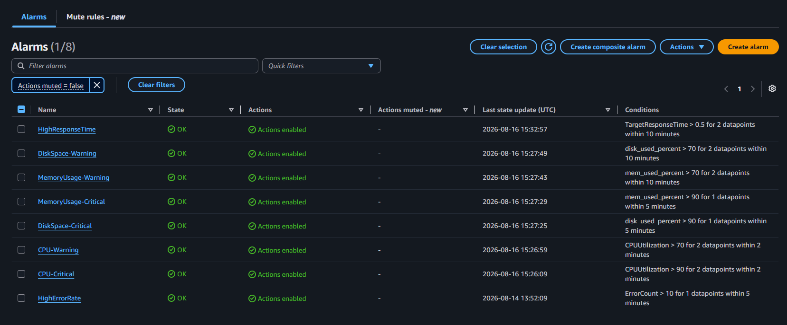
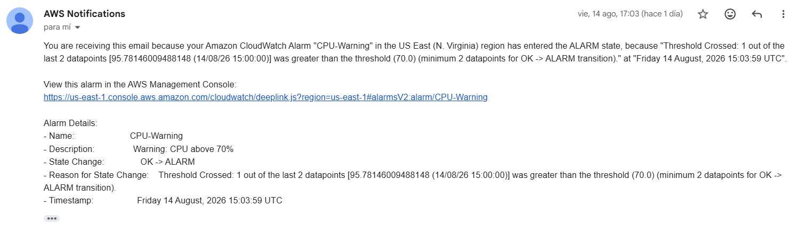

# Alerting System 

## Alert strategy

### Alarm 1: CPU Utilization 

The first alarm to be wired to the CloudWatch channel is the CPU Utilization. This metric is published by EC2 itself. For this metric, two alarms were created to warn the engineers before the CPU Usage reaches a critical threshold. 

**Warning Alarm**

- Period: 300 seconds (5 minutes)
- Evaluation periods: 2 (10 minutes total)
- Threshold: 70%
- Justification: CPU Usage is high but in a threshold where an action can still be performed.  
- Comparison: GreaterThan

```bash 
aws cloudwatch put-metric-alarm \
  --alarm-name CPU-Warning \
  --alarm-description "Warning: CPU above 70%" \
  --metric-name CPUUtilization \
  --namespace AWS/EC2 \
  --statistic Average \
  --period 300 \
  --threshold 70 \
  --comparison-operator GreaterThanThreshold \
  --evaluation-periods 2 \
  --dimensions Name=InstanceId,Value=$INSTANCE_ID \
  --alarm-actions $TOPIC_ARN
```

**Critical Alarm**

- Period: 300 seconds (5 minutes)
- Evaluation periods: 1
- Threshold: 90%
- Justification: CPU Usage is almost reaching 100%, immediate action must be performed.  
- Comparison: GreaterThan


```bash 
aws cloudwatch put-metric-alarm \
  --alarm-name CPU-Critical \
  --alarm-description "CRITICAL: CPU above 90%" \
  --metric-name CPUUtilization \
  --namespace AWS/EC2 \
  --statistic Average \
  --period 300 \
  --threshold 90 \
  --comparison-operator GreaterThanThreshold \
  --evaluation-periods 1 \
  --dimensions Name=InstanceId,Value=$INSTANCE_ID \
  --alarm-actions $TOPIC_ARN
```

### Alarm 2: Memory Utilization

The memory utilization is also wired to the CloudWatch channel. This metrics comes from CWAgent, so the metrics collection must be added by creating a filter that will count the matching lines in the log group. 

**Warning Alarm**

- Period: 300 seconds (5 minutes)
- Evaluation periods: 2 (10 minutes total)
- Threshold: 70%
- Justification: Memory Usage is high but in a threshold where an action can still be performed.  
- Comparison: GreaterThan

```bash 
aws cloudwatch put-metric-alarm \
  --alarm-name MemoryUsage-Warning \
  --alarm-description "Warning: Memory above 70%" \
  --metric-name mem_used_percent \
  --namespace CWAgent \
  --statistic Average \
  --period 300 \
  --threshold 70 \
  --comparison-operator GreaterThanThreshold \
  --evaluation-periods 2 \
  --dimensions Name=InstanceId,Value=$INSTANCE_ID \
  --alarm-actions $TOPIC_ARN
```

**Critical Alarm**

- Period: 300 seconds (5 minutes)
- Evaluation periods: 1
- Threshold: 90%
- Justification: Memory Usage is almost reaching 100%, immediate action must be performed.  
- Comparison: GreaterThan


```bash 
aws cloudwatch put-metric-alarm \
  --alarm-name MemoryUsage-Critical \
  --alarm-description "Critical: Memory above 90%" \
  --metric-name mem_used_percent \
  --namespace CWAgent \
  --statistic Average \
  --period 300 \
  --threshold 90 \
  --comparison-operator GreaterThanThreshold \
  --evaluation-periods 1 \
  --dimensions Name=InstanceId,Value=$INSTANCE_ID \
  --alarm-actions $TOPIC_ARN
```

### Alarm 3: Disk Space

**Warning Alarm**

- Period: 300 seconds (5 minutes)
- Evaluation periods: 2 (10 minutes total)
- Threshold: 70%
- Justification: Disk Space is running out but in a threshold where an action can still be performed.  
- Comparison: GreaterThan

```bash 
aws cloudwatch put-metric-alarm \
  --alarm-name DiskSpace-Warning \
  --alarm-description "Warning: Disk Space below 30%" \
  --metric-name disk_used_percent \
  --namespace CWAgent \
  --statistic Average \
  --period 300 \
  --threshold 70 \
  --comparison-operator GreaterThanThreshold \
  --evaluation-periods 2 \
  --dimensions Name=InstanceId,Value=$INSTANCE_ID Name=path,Value=/ Name=device,Value="nvme0n1p1" Name=fstype,Value="xfs" \
  --alarm-actions $TOPIC_ARN
```

**Critical Alarm**

- Period: 300 seconds (5 minutes)
- Evaluation periods: 1
- Threshold: 90%
- Justification: Disk Space is almost full, immediate action must be performed.  
- Comparison: GreaterThan


```bash 
aws cloudwatch put-metric-alarm \
  --alarm-name DiskSpace-Critical \
  --alarm-description "Critical: Disk Space below 10%" \
  --metric-name disk_used_percent \
  --namespace CWAgent \
  --statistic Average \
  --period 300 \
  --threshold 90 \
  --comparison-operator GreaterThanThreshold \
  --evaluation-periods 1 \
  --dimensions Name=InstanceId,Value=$INSTANCE_ID Name=path,Value=/ Name=device,Value="nvme0n1p1" Name=fstype,Value="xfs" \
  --alarm-actions $TOPIC_ARN
```

### Alarm 4: Application Error Rate Alarm 

Create the alarm with the following parameters: 

- Period: 300 seconds (5 minutes)
- Evaluation periods: 1
- Threshold: 10
- Justification: Having an error rate of 2 errors per minute is sufficient to consider that there is an issue.  
- Comparison: GreaterThan

```bash
aws cloudwatch put-metric-alarm \
  --alarm-name HighErrorRate \
  --alarm-description "Alert when error rate exceeds 10 per 5 minutes" \
  --metric-name ErrorCount \
  --namespace Application \
  --statistic Sum \
  --period 300 \
  --threshold 10 \
  --comparison-operator GreaterThanThreshold \
  --evaluation-periods 1 \
  --alarm-actions $TOPIC_ARN \
  --treat-missing-data notBreaching
```

## Alarm 5: Application Load Balancer Response Time Alert

This alarm is triggered when the Load Balancer response exceeds 500 ms.

```bash
aws cloudwatch put-metric-alarm \
  --alarm-name HighResponseTime \
  --alarm-description "Alert when P95 latency exceeds 500ms" \
  --metric-name TargetResponseTime \
  --namespace AWS/ApplicationELB \
  --extended-statistic p95 \
  --period 300 \
  --threshold 0.5 \
  --comparison-operator GreaterThanThreshold \
  --evaluation-periods 2 \
  --dimensions Name=LoadBalancer,Value=$LB_DIMENSION \
  --alarm-actions $TOPIC_ARN
```


## SNS topic configuration

Create an SNS topic, which is the destination that an alarm publishes to. 

```bash
TOPIC_ARN=$(aws sns create-topic \
  --name CloudWatchAlerts \
  --tags Key=Environment,Value=Production \
  --query 'TopicArn' \
  --output text)
```

**Topic ARN:** arn:aws:sns:us-east-1:829910101871:CloudWatchAlerts

After SNS Topic is created, an email is subscribed to receive notifications. 

```bash
aws sns subscribe \
  --topic-arn $TOPIC_ARN \
  --protocol email \
  --notification-endpoint julioaldana.deu@gmail.com
```

## Response procedures

The alarm status for each alarm can be seen in the AWS Console under _CloudWatch/Alarms_ section. 



Additionally, the alarms sends an SNS notification, every time an alarm has been triggered. The email contains the details of the alarms, such as the state change, the description of the alarm, the timestamp and the reason of the triggering. The notification looks as follows: 



For each alarm, these are possible responses: 

1. **CPU Warning / CPU Critical**
  - Check which EC2 instance/service is affected and how long CPU has been high.
  - Look at CloudWatch metrics for CPU, request rate, network traffic, and application activity.
  - Identify the processes consuming CPU.
  - Check whether the increase is expected, such as a traffic spike or scheduled job.
  - If it is unexpected, investigate the application/process causing the load.
  - If the workload is genuinely too large for the instance, consider scaling horizontally or vertically.
  - Verify CPU usage returns to an acceptable level after remediation.

2. **Memory Usage Warning / Memory Usage Critical** 
  - Identify the affected instance/container and check memory and application metrics.
  - Determine whether a particular process is consuming excessive memory.
  - Look for memory leaks, increased traffic, or a recent application deployment.
  - If necessary, restart the affected service as a short-term mitigation.
  - Consider increasing instance/container memory or scaling out if the workload has legitimately increased.
  - Investigate the root cause so that simply restarting the service doesn't become the permanent solution.

3. **Disk Space Warning / Disk Space Critical**
  - Identify which instance and filesystem/volume is filling up.
  - Check what is consuming the disk-logs, temporary files, application data, Docker images, etc.
  - Remove or archive unnecessary files safely.
  - Check whether log rotation and retention are working correctly.
  - If the data is legitimate and expected to grow, increase the EBS volume and/or implement a better storage strategy.
  - Verify sufficient free space remains afterward.

4. **Application Error Rate**
  - Treat this as potentially high priority, especially if customer traffic is affected.
  - Check application logs and CloudWatch metrics to determine the type and source of errors.
  - Check recent deployments, configuration changes, dependency failures, database issues, and infrastructure health.
  - Determine whether the errors affect all users or only a particular endpoint/service.
  - If a recent deployment caused the problem, roll back if appropriate.
  - Continue monitoring until the error rate returns to normal.

5. **ALB Response Time Alert** 
  - Check whether the latency increase is isolated to one endpoint/service or affects the whole application.
  - Compare latency with CPU, memory, database, network, and request-rate metrics.
  - Examine application logs and traces if available.
  - Look for slow database queries, external API delays, resource exhaustion, increased traffic, or a recent deployment.
  - Scale the affected service if the problem is capacity-related.
  - Optimize or fix the underlying bottleneck if it is application-related.
  - Verify latency returns to the normal range.

## Runbook for each alert

1. **High CPU Utilization**

- [ ] Identify the affected EC2 instance/service.
- [ ] Check CPU utilization in CloudWatch and determine how long it has been elevated.
- [ ] Check whether traffic/request volume has increased.
- [ ] Identify processes consuming excessive CPU.
- [ ] If caused by expected traffic, scale the service/instance if necessary.
- [ ] If caused by a runaway process, restart the affected service if safe.
- [ ] Monitor CPU until it returns to normal.
- [ ] Escalate if CPU remains high or the application is unavailable.

2. **High Memory Utilization**

- [ ] Identify the affected EC2 instance/container.
- [ ] Check memory utilization and available memory.
- [ ] Identify processes consuming the most memory.
- [ ] Check for recent deployments or configuration changes.
- [ ] If memory usage is caused by a temporary issue, restart the affected service if appropriate.
- [ ] If the workload legitimately requires more memory, scale the instance/container.
- [ ] Monitor memory usage after remediation.
- [ ] Escalate if memory continues to increase or the application becomes unstable.

3. **Low Disk Space**

- [ ] Identify the affected instance and filesystem.
- [ ] Check disk usage and identify which directories/files are consuming space.
- [ ] Check application and system logs.
- [ ] Check whether log rotation is working correctly.
- [ ] Safely remove unnecessary temporary files or old logs according to the retention policy.
- [ ] If appropriate, archive data to durable storage such as S3.
- [ ] If additional capacity is required, increase the EBS volume.
- [ ] Verify sufficient free space is available.
- [ ] Confirm the CloudWatch alarm returns to OK.
- [ ] Escalate if disk space continues to decrease or cannot safely be freed.

4. **High Application Error Rate**

- [ ] Check the error-rate CloudWatch metric and determine when the problem started.
- [ ] Check application logs for the specific errors.
- [ ] Check whether there was a recent deployment or configuration change.
- [ ] Check dependent services such as databases, APIs, queues, and other AWS services.
- [ ] Determine whether the problem affects all users or a specific endpoint.
- [ ] If a recent deployment caused the issue, consider rolling it back.
- [ ] If the service is overloaded, scale it if appropriate.
- [ ] Monitor the error rate after taking corrective action.
- [ ] Escalate immediately if the application remains unavailable or customer impact is significant.

5. **High Response Time Runbook**

- [ ] Identify the affected application/service or endpoint.
- [ ] Check when the latency increase started.
- [ ] Check request volume and traffic patterns.
- [ ] Compare latency with CPU, memory, disk, and network metrics.
- [ ] Check application logs and traces for slow operations.
- [ ] Check database performance and slow queries.
- [ ] Check external API/dependency latency.
- [ ] Check for recent deployments or configuration changes.
- [ ] Scale the affected service if the problem is capacity-related.
- [ ] Roll back a recent change if it is identified as the likely cause.
- [ ] Monitor response time until it returns to the normal range.
- [ ] Escalate if latency remains high or customers are experiencing significant impact.