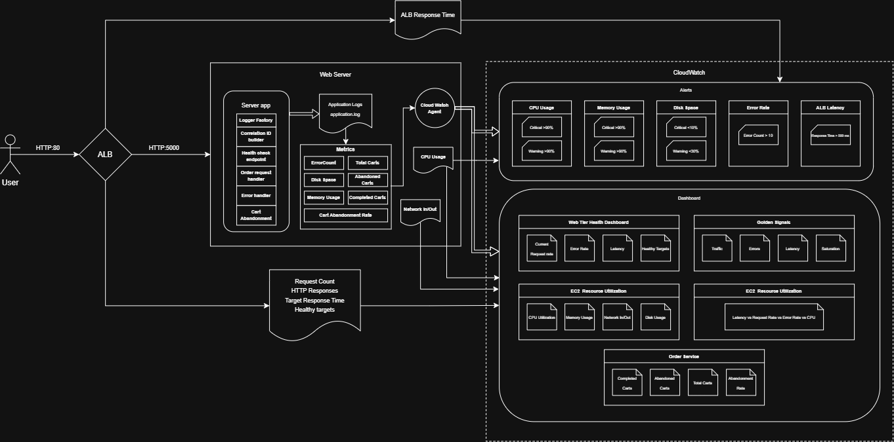

# Architecture 

## Architecture diagram

## Components and their purpose

### Web Server

This component contains the application that handles the user requests create the logs to be sent to CloudWatch. The goals of this components are the following: 

- Collect and store logs by using a logger factory 
- Build a correlation ID for each logging event. 
- Report health check status to ALB. 
- Handle error requests. 
- Create order and carts from customer interaction with the server. 
- The instance generates metrics such as CPU Usage and Network In/Out, relevant for monitoring. 

### CloudWatch Agent 

The purpose of this component is to collect the metrics from the logs generate by the application and send them to CloudWatch to populate the alarms and dashboard widgets.  

### CloudWatch Alerts

This component contains the alarms that are triggered whenever a certain metric reaches a configured threshold. The purpose of the alerts is to notify the on-call engineers that an anormal behavior is happening. This notification serves as the first information for a Root Cause Analysis, since it informs that a potential new defect has been created and the reason of the defect. 

### CloudWatch Dashboard

The purpose of this component is to monitor in real-time the behavior of the system. It helps to further perform the root cause analysis by displaying relevant information such as Request Rate, Error Rate, Latency, Healty Targets and Resource metrics. Observation of the information through time is useful to correlate an issue with its possible cause. A correlation view is also added to the dashboard to facilitate the comparison between most relevant metrics that may affect the functionality of the system. 

Additionally, the dashboard displays business metrics, which purpose is to show the user experience with the server. 

### Application Load Balancer 

The purpose of this component is to receive the requests from the user and distribute them to its targets, i. e., the servers available in the target group. The application load balancer also collects relevant metrics to be used in the alarms and dashboard, such as the target response time, request count, response codes and healthy targets. 

## Data flow 

- **Logs**: The application populates a logger in each event/request received. At the end of each endpoint, the logger is called and populated with the relevant information calculated in the endpoint and sent it to the file _application.log_

- **Metrics**: Metrics come from three different sources: 
  1. Metrics created from the application logs. A CloudWatch Agent access the logs and filters for an specific service, id or event. The information filtered is sent to cloudwatch to be used in the alerts or dashboards. 
  2. The EC2 Instance itself generates metrics, which are directly accesible from CloudWatch (no CW Agent needed).
  3. Similar to the EC2 Instance, the ALB generates metrics that are also directly given to CloudWatch. 

- **Alerts**: The information coming from the ALB, EC2 and CW Agent is compared to certain threshold to trigger an alarm, which generates a SNS Notification via Email. 

- **Dashboard** The information coming from ALB, EC2 and CW Agent is displayed in widgets in a numerical and graphical format through time. 

## Technology 

- Web Server: EC2 Instance t3.micro
- Application: Python 3.9
- Log collection: CloudWatch Agent
- Alerting system: CloudWatch
- Dashboard: CloudWatch
- Request collection and distribution: Application Load Balancer 
