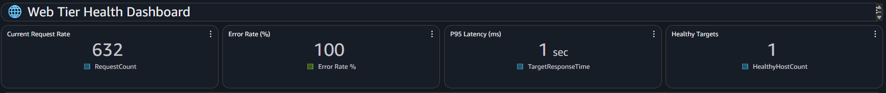
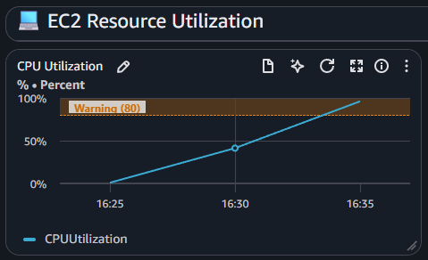
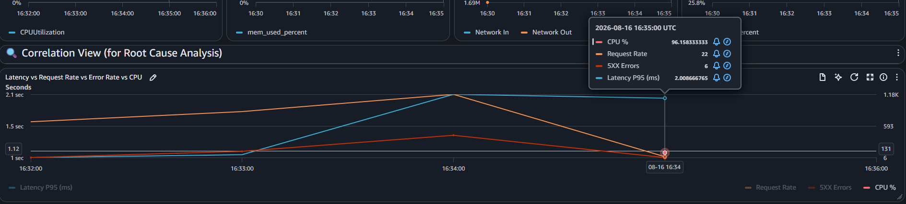

# Incidents

## Incident summary

**Incident:** API latency increased from 200ms (P95) to 2,000ms (P95)  
**Impact:** 2,500 users experienced slow page loads, 35% error rate  
**Duration:** 60 minutes (17:00-18:00 UTC, Aug 14, 2024)  
**Root Cause:**  Unexpected traffic/application workload 
**Status:** Resolved

## Timeline
 
| Time (UTC) | Event |
|------------|-------|
| 14:00 | CloudWatch alarm triggered: High latency detected |
| 14:05 | CloudWatch alarm triggered: High Error Rate detected |
| 14:10 | Investigation started using RED method |
| 14:15 | Confirmed elevated error rate and latency |
| 14:20 | USE method applied to resources |
| 14:25 | Identified EC2 CPU Usage at 96% |
| 14:30 | ROOT CAUSE: Unexpected traffic/application workload |
| 14:35 | Immediate fix: Increase the number of EC2 instances in the ALB |
| 14:40 | Service began recovering |
| 14:50 | Latency returned to normal |
| 15:00 | Incident closed |

## RED Method Analysis

### Rate (Traffic)

- Normal: 25 req/min
- Incident: 632 req/min - See Health Dashboard Error Rate
- **Finding: 10x traffic increase**
 
### Errors

- Normal: 0.1%
- Incident: 35.0% during the incident - See Golden Signals Error Rate
- **Finding: 70x error increase**

### Duration (Latency)

- Normal P95: 200ms
- Incident P95: 2,000ms
- **Finding: 10x latency increase**

 

### Conclusion

All three RED signals elevated. Significant performance degradation.
Primary symptom: High latency (10x increase)

## USE Method Summary
 
### Memory
- ✅ Utilization: 25% (normal)
- ✅ Saturation: No swapping
- ✅ Errors: None

### CPU
- 🔴 Utilization: 95% (abnormal)
- 🔴 Saturation: Abormal
- 🔴 Errors: Timeout errors

 
### Conclusion

**ROOT CAUSE IDENTIFIED: Ec2 instance undersized**

## Root causes identified

- **Problem:** The EC2 instance is undersized for the workload, or an unexpected traffic/application workload spike is exhausting available CPU

## Fixes applied

### Immediate (Week 1)
- [x] Stop non-critical batch jobs or scheduled workloads.
- [x] Increase the number of EC2 instances in the ALB
- [x] Restart the application can temporary restore the performance. 
 
### Short-term (Month 1)
- [ ] Implement auto-scaling for ALB
- [ ] Optimize the application to find CPU-intensive code.
- [ ] Size the instance based on observed CPU Usage
 
### Long-term (Quarter 1)
- [ ] Perform load tests to determine the maximum sustainable request rate
- [ ] Optimize inefficient algorithms, loops, serialization, request processing, or background jobs

## Lessons learned

### What Went Well ✅

- Alerts triggered immediately (within 1 minute)
- On-call engineer responded quickly (5 minutes)
- Systematic RED/USE methodology led to root cause
- Clear monitoring data available
- Mitigation applied quickly (10 minutes to identify, 5 to fix)
 
### What Went Wrong ❌

- No capacity planning for marketing campaigns
- Connection pool not monitored (no alerts)
- No auto-scaling configured
- Lack of communication between marketing and engineering
- No load testing performed