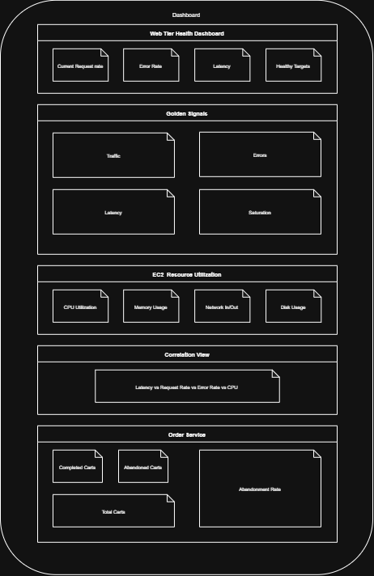
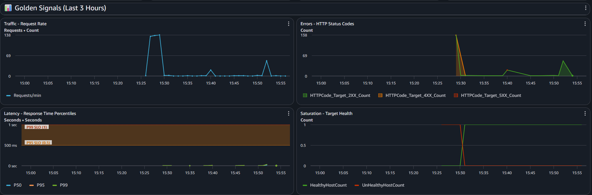
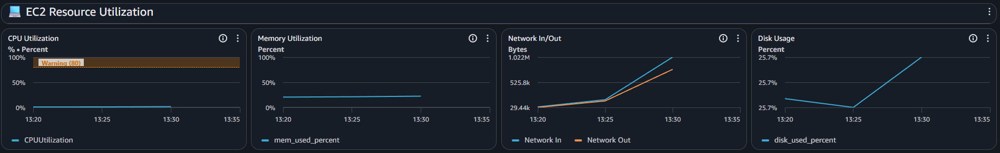

# Monitoring

## Dashboard design and rationale

The design of the dashboard is shown in the following picture: 



To make any updates, refer to the *dashboard.json* file and run the following command after every update. 

```bash
aws cloudwatch put-dashboard \
  --dashboard-name Project2_WebTierMonitoring \
  --dashboard-body file://dashboard.json
```


## Golden Signals implementation

### Trafic - Request Rate

This metric is extracted from the Application Load Balancer metrics, i. e., the namespace _AWS/ApplicationELB_. The metric used is called _RequestCount_ under the Load Balancer dimensions. The widget displays the sum of the requests per minute. The main implementation in the _dashboard.json_ is the following: 

```bash
"properties": {
    "title": "Traffic - Request Rate",
    "metrics": [
        [
            "AWS/ApplicationELB",
            "RequestCount",
            "LoadBalancer",
            "app/logging-p2-alb/7c4aa27ebf3935b4",
            {
                "stat": "Sum",
                "label": "Requests/min"
            }
        ]
    ],
    "view": "timeSeries",
    "region": "us-east-1",
    "period": 60,
    "stat": "Sum",
    "yAxis": {
        "left": {
            "label": "Requests"
        }
    }
}
```

### Errors - HTTP Status Codes

These metrics is extracted from the Application Load Balancer metrics, i. e., the namespace _AWS/ApplicationELB_. The metrics used are called *HTTPCode_Target_5XX_Count*, *HTTPCode_Target_4XX_Count* and *HTTPCode_Target_2XX_Count* under the Load Balancer dimensions. The widget displays the response codes given so far. The main implementation in the _dashboard.json_ is the following: 

```bash
"properties": {
    "metrics": [
        [
            "AWS/ApplicationELB",
            "HTTPCode_Target_5XX_Count",
            "LoadBalancer",
            "app/logging-p2-alb/7c4aa27ebf3935b4",
            {
                "color": "#d13212",
                "region": "us-east-1"
            }
        ],
        [
            ".",
            "HTTPCode_Target_4XX_Count",
            ".",
            ".",
            {
                "color": "#ff7f0e",
                "region": "us-east-1"
            }
        ],
        [
            ".",
            "HTTPCode_Target_2XX_Count",
            ".",
            ".",
            {
                "color": "#2ca02c",
                "region": "us-east-1"
            }
        ]
    ],
    "title": "Errors - HTTP Status Codes",
    "view": "timeSeries",
    "stacked": true,
    "region": "us-east-1",
    "period": 60,
    "stat": "Sum"
}
```

### Latency - Response Time Percentiles

This metric is extracted from the Application Load Balancer metrics, i. e., the namespace _AWS/ApplicationELB_. The metric used is called _TargetResponseTime_ under the Load Balancer dimensions. The widget displays the percentiles P50, P95 and P99. Two horizontal lines are placed to indicate the limit times of P95 and P99. The main implementation in the _dashboard.json_ is the following:

```bash
"properties": {
    "metrics": [
        [
            "AWS/ApplicationELB",
            "TargetResponseTime",
            "LoadBalancer",
            "app/logging-p2-alb/7c4aa27ebf3935b4",
            {
                "stat": "p50",
                "label": "P50",
                "region": "us-east-1"
            }
        ],
        [
            "...",
            {
                "stat": "p95",
                "label": "P95",
                "region": "us-east-1"
            }
        ],
        [
            "...",
            {
                "label": "P99",
                "region": "us-east-1"
            }
        ]
    ],
    "title": "Latency - Response Time Percentiles",
    "view": "timeSeries",
    "region": "us-east-1",
    "period": 60,
    "yAxis": {
        "left": {
            "min": 0,
            "label": "Seconds"
        }
    },
    "annotations": {
        "horizontal": [
            {
                "value": 0.5,
                "label": "P95 SLO",
                "fill": "above",
                "color": "#ff7f0e"
            },
            {
                "value": 1,
                "label": "P99 SLO",
                "fill": "above",
                "color": "#d13212"
            }
        ]
    },
    "stat": "p99"
}
```

### Saturation - Target Health 

This metric is extracted from the Application Load Balancer metrics, i. e., the namespace _AWS/ApplicationELB_. The metrics used are called _HealthyHostCountt_ and _UnHealthyHostCount_ under the Load Balancer and Target Group dimensions. The widget displays the average of healthy and unhealthy targets. The main implementation in the _dashboard.json_ is the following: 

```bash
"properties": {
  "title": "Saturation - Target Health",
  "metrics": [
      [
          "AWS/ApplicationELB",
          "HealthyHostCount",
          "LoadBalancer",
          "app/logging-p2-alb/7c4aa27ebf3935b4",
          "TargetGroup",
          "targetgroup/logging-p2-tg/66c7e78b44e6e9fa",
          {
              "stat": "Average",
              "color": "#2ca02c"
          }
      ],
      [
          ".",
          "UnHealthyHostCount",
          "LoadBalancer",
          "app/logging-p2-alb/7c4aa27ebf3935b4",
          "TargetGroup",
          "targetgroup/logging-p2-tg/66c7e78b44e6e9fa",
          {
              "stat": "Average",
              "color": "#d13212"
          }
      ]
  ],
```

## Widget explanations

### Web Tier Health Dashboard 

- **Current Request Rate:** This widget shows the metric that represents the number of requests received by the server per minute. 
- **Error Rate (%):** This widget shows the calculation of the error responses in relationship with the total requests. 
- **P95 Latency (ms):** This widget shows the response time of the targets for 95% of the requests. Percentile 95 is used to show the real user experience. 
- **Healthy Targets:** This widget displays the total amount of targets that are healthy for the Application Load Balancer 


### Golden Signals

- **Traffic - Request Rate:** This widget contains a line graph that displays the request count history along time. 
- **Errors - HTTP Status Codes:** This widget contains a line graph that displays the count of the different HTTP Status Code Responses, which are filtered by HTTP Code 2XX, HTTP Code 4XX and HTTP Code 5XX. 
- **Latency - Response Time Percentiles:** This widget contains a line graph with the percentiles P50, P95 and P99 of the response time. This helps to compare the response time for each request. 
- **Saturation - Target Health:** This widgets contains a line graph with the count of healthy and unhealthy targets along time. 



### EC2 Resource Utilization

- **CPU Utilization:** This widget shows the percentage of CPU Usage along time. As annotation, a warning line is placed at 70% to improve the visualization of a potential issue related to CPU Usage. 
- **Memory Utilization:** This widget shows how much memory has been used in the instance. 
- **Network In/Out:** This widget contains a line graph that indicate the amount of data that is inbounded and outbounded from the server. 
- **Disk Usage:** This widget shows how much disk space has been used in the instance.




### Correlation View 

This graphic combines the data of the following metrics along time: 

- P95 Latency
- Request Rate 
- HTTP 5XX Code Responses
- CPU Usage

## How to use dashboard for troubleshooting

A guide to use the dashboard can be found in _docs/dashboard-guide.md_.

