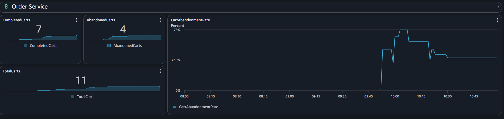

# Demo Script

## First Demo: Inject Failure

In order to inject the failure:

- Run the script *saturation_sim.py* located in *app/simulation*. 

```bash
cd ./app
python3 saturation_sim.py
```

- When the script is almost done of sending 10 request per minute, run the command:

```bash 
stress-ng --cpu 4 --cpu-load 70 --timeout 7m
```

## Second Demo: Bussiness metrics 

1. Open the following website in a browser:

```bash
http://logging-p2-alb-1152847628.us-east-1.elb.amazonaws.com/ui
```

2. In the *Create Cart* section, enter a User ID and the number of items

3. If you want to complete the order, go to *Complete Order* section, enter the Cart ID (given as response in the *Create Cart* section) and the amount of the order. 

4. If you want to increase the number of abandoned carts, wait 60 seconds after creating a cart (without completing the order). 

